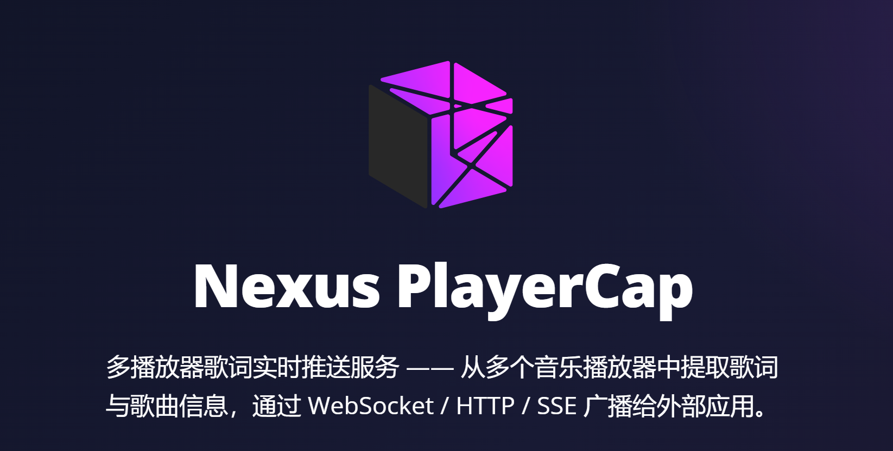

<div align="center">



# VTB-TOOLS Metabox-Nexus-PlayerCap

多播放器歌词实时推送服务 —— 从多个音乐播放器中提取歌词与歌曲信息，通过 WebSocket / HTTP / SSE 广播给外部应用。
</br>
**纯 Go 实现** · Windows 专用 · 支持优先级路由 · 自动更新

</div>

## 支持的播放器

| 播放器 | 标识名 | 提取方式 |
|--------|--------|----------|
| 全民K歌 | `wesing` | 进程内存读取（PE 导出表 + vtable + AOB 扫描） |
| 网易云音乐 | `cloudmusicv3` | CDP 远程调试 |
| QQ 音乐 | `qqmusic` | 进程内存读取 + AOB Hook 注入（双源融合插值） |
| 酷狗音乐 | `kugou` | CDP 远程调试 |
| 汽水音乐 | `sodamusic` | CDP 远程调试 |

## 功能特性

- ✅ **多播放器支持** — 同时监控全民K歌、网易云音乐、QQ 音乐、酷狗音乐和汽水音乐，优先级路由自动切换
- ✅ **三种接口** — WebSocket（双向实时）、SSE（单向推送）、HTTP（静态查询）
- ✅ **Per-player 端点** — 每个播放器独立端点（`/wesing/ws`、`/cloudmusicv3/ws`、`/qqmusic/ws`、`/kugou/ws`、`/sodamusic/ws` 等）
- ✅ **播放器切换事件** — 活跃播放器变化时推送 `player_switch` + 新播放器完整状态
- ✅ **自动等待进程** — 目标播放器未启动时持续等待，启动后自动开始
- ✅ **暂停/恢复检测** — 判据按播放器而异：wesing、qqmusic 按播放时间停滞判定；cloudmusicv3、kugou、sodamusic 直接读平台上报的播放状态。两者都在恢复推进时广播恢复事件
- ✅ **歌曲信息提取** — 歌名、歌手、封面 URL、封面 Base64
- ✅ **实时歌词推送** — 可调轮询频率，广播当前歌词行（含播放进度）
- ✅ **逐字歌词** — 五家输出每字的时间戳与持续时间（`text_detailed`）：cloudmusicv3（YRC）、qqmusic（QRC）、kugou（KRC）、sodamusic（明文 KRC）、wesing（进程内存的卡拉OK字级时间），前端可实现卡拉OK式逐字高亮
- ✅ **翻译歌词** — cloudmusicv3、qqmusic、kugou、sodamusic 解析第二行翻译（`sub_text`）；wesing 无翻译源
- ✅ **状态广播** — 等待进程 / 等待歌曲 / 播放中 / 暂停 / 待机，以及 kugou 的故障终态
- ✅ **进程断线重连** — 播放器退出后自动回到等待状态，重新启动后自动恢复
- ✅ **时间偏移** — 支持全局和 per-player 正/负毫秒偏移，微调歌词同步
- ✅ **无活跃自动隐藏** — 「指定播放器」（per-player）通道歌停后可自动清屏、隐藏停留的末行歌词（`per-player-idle-hide`，默认关，可按播放器覆盖）
- ✅ **配置文件** — config.yml + CLI flag 三层合并（CLI > YAML > 默认值）
- ✅ **自动更新** — 启动时检查新版本，自动下载 + SHA256 校验 + 热重启
- ✅ **UTF-8 文本** — 歌词与歌曲信息以 UTF-8 编码传输，不限语种
- ✅ **跨重启稳定** — AOB 特征搜索，地址动态定位（WeSing / QQMusic）；CDP 远程连接（CloudMusic / KuGou / SodaMusic）
- ✅ **酷狗自动接入** — 自动检测酷狗安装和 CDP patch 状态，支持自动提权修补 libcef.dll、重启酷狗并等待端口就绪
- ✅ **网易云特效歌词镜像** — 直读网易云「特效歌词」WebGL 画面（极光/霓虹/液态流体…）镜像给 OBS；只读不动源画面，主播可常开工具栏；多播放器联动淡入/淡出，最小化可屏外保活，非特效时可回退纯净歌词（详见[网易云特效歌词镜像](#网易云特效歌词镜像)）


### 多播放器路由

```
Router（事件合并主循环）
├─ 优先播放器（prior-player）播放/加载时立即抢占输出
├─ 优先播放器暂停时保持 holding，超时（prior-player-expire）后释放
├─ 优先播放器空闲时释放控制权给普通播放器
├─ 普通播放器也有独立的状态追踪和组级超时（与优先组对称）
├─ 优先组释放时强制清除普通组 holding 状态，仅 playing/loading 的普通播放器存活
├─ 普通组全员无活动时清空输出（player_clear 事件）
├─ 根订阅者（/ws）只收活跃播放器事件
├─ 单播放器订阅者（/<player>/ws）始终收对应播放器事件
└─ 播放器切换时推送 player_switch 事件 + 新播放器完整初始状态
```

## 快速开始

### 前置条件

- Go 1.25+
- Windows 10/11
- 任意支持的播放器

### 编译

```bash
# 编译
go build -ldflags "-s -w" -o Metabox-Nexus-PlayerCap.exe .

# 编译并注入版本号（可选）
go build -ldflags "-X main.Version=3.0.0-beta.5" -o Metabox-Nexus-PlayerCap.exe .
```

### 自动更新版本规则

- 真实版本号使用完整 semver，例如 `3.0.0-alpha.1`、`3.0.0-beta.32`、`3.0.0-rc.1.a`、`3.0.0`。
- 预发布顺序遵循 `alpha < beta < rc < stable`，并允许按纯 semver 自动升级到更高 minor 的预发布版本，例如 `3.0.0-beta.32 -> 3.1.0-alpha.13`。
- 发布版本由 release `tag_name` 决定；若 release 标题 `name` 以 `-force` 结尾，则允许客户端强制同步到更低版本。
- 默认开发构建（如 `0.0.0` 或非 semver 版本号）不会参与自动更新检查。

维护者的发布与回退 SOP 见 [AGENTS.md](AGENTS.md) 的“12. 发版”。


### 运行

> ⚠️ 需要**管理员权限**运行（读取其他进程内存需要 `PROCESS_VM_READ` 权限）
> 酷狗音乐首次接入时会检测并自动 patch `libcef.dll` 以开启 CDP 端口，过程中可能触发 UAC；若检测到未知 libcef 版本，将不会强行修改，需等待适配或手动处理。

```bash
# 直接运行（使用 config.yml 或默认配置）
.\Metabox-Nexus-PlayerCap.exe

# 歌词提前 500ms 显示
.\Metabox-Nexus-PlayerCap.exe -offset 500

# 指定网易云音乐的偏移量
.\Metabox-Nexus-PlayerCap.exe -cloudmusicv3-offset 300
```

### 命令行参数

格式 `-参数 值`（如 `-offset 500`），优先级最高（> config.yml > 内置默认）；`-h` 打印全部参数。

| 参数 | 默认值 | 说明 |
|------|--------|------|
| `-addr` | `0.0.0.0:8765` | HTTP/WebSocket/SSE 监听地址 |
| `-offset` | `200` | 全局时间偏移（毫秒），正值=歌词提前，负值=延后 |
| `-poll` | `30` | 全局轮询间隔（毫秒），范围 10~2000 |
| `-prior-player` | `wesing` | 优先播放器列表，逗号分隔（如 `wesing,kugou`），一开唱立即抢占主输出；传空串=无优先播放器 |
| `-prior-player-expire` | `15` | 优先播放器暂停超过 N 秒后释放主输出；`0`=关闭全部超时（含普通组），慎用 |
| `-per-player-idle-hide` | `0` | 「指定播放器」通道无活跃 N 秒后自动清屏隐藏末行；`0`=关。仅作用于 per-player 端点，不影响根路径 |
| `-cloudmusicv3-effect-strategy` | `fadeout` | 网易云特效最小化策略：`park`（屏外渲染保活）/ `fadeout`（自动淡出） |
| `-<player>-offset` | *(沿用 `-offset`)* | 指定播放器专属时间偏移（毫秒） |
| `-<player>-poll` | *(沿用 `-poll`)* | 指定播放器专属轮询间隔（毫秒） |
| `-<player>-idle-hide` | *(沿用 `-per-player-idle-hide`)* | 指定播放器专属无活跃自动隐藏（秒，`0`=该播放器关闭） |

> `<player>` ∈ `wesing` / `cloudmusicv3` / `qqmusic` / `kugou` / `sodamusic`，专属参数由 `config.RegisterPlayer()` 动态生成，未设置时自动沿用全局值。例：`-cloudmusicv3-offset 300`、`-wesing-idle-hide 15`。
>
> 各播放器另有自己的轮询下限，低于它的取值会被静默抬高：cloudmusicv3 低于 50 抬到 100、
> qqmusic 低于 30 抬到 50、sodamusic 低于 200 抬到 200。

### 配置文件

优先级：**命令行参数** > **config.yml** > **内置默认值**

程序启动时自动加载同目录下的 `config.yml`，若不存在则自动生成：

```yaml
# Metabox-Nexus-PlayerCap 配置文件
# 优先级：命令行参数 > config.yml > 内置默认值

# HTTP/WebSocket/SSE 监听地址
addr: "0.0.0.0:8765"

# 歌词时间偏移（毫秒），正值=歌词提前，负值=延后
offset: 200

# 轮询间隔（毫秒），范围 10~2000
poll: 30

# 优先播放器；按需取消注释以分配
prior-player:
- wesing
# - cloudmusicv3
# - qqmusic
# - kugou
# - sodamusic

# 优先播放器暂停超过n秒，自动切换到最后一个普通播放器
prior-player-expire: 15

# 「指定播放器」通道（/<player>/ws 等）无活跃自动隐藏：静默超过 n 秒后清屏，隐藏停留的末行歌词。
# 0 = 关闭（默认）。仅作用于 per-player 端点，不影响跟随活跃播放器的根路径。
# 每个播放器可用 <player>-idle-hide 覆盖（不写=跟随全局，0=该播放器关闭）。
per-player-idle-hide: 0

# 全民K歌 配置
# wesing-offset: 0
# wesing-poll: 30
# wesing-idle-hide: 15   # 无活跃自动隐藏（秒）：不写=跟随全局 per-player-idle-hide，0=该播放器关闭

# 网易云音乐 v3 配置
cloudmusicv3-offset: 500
# cloudmusicv3-poll: 100   # 低于 50 会被网易云自身的下限抬到 100，写 30 也是跑 100
cloudmusicv3-effect-strategy: fadeout # 特效最小化策略：park 自动屏外渲染保活 / fadeout 自动淡出

# QQ 音乐 配置
qqmusic-offset: 400
# qqmusic-poll: 50

# 酷狗音乐 配置
kugou-offset: 430
# kugou-poll: 30

# 汽水音乐 配置
sodamusic-offset: 340
# sodamusic-poll: 200     # 低于 200 会被静默抬到 200（每次 Extract 是主进程→渲染器桥 + transport 往返，较重）
```

### 预期输出

```
===========================================================
VTB-TOOLS Metabox Nexus-PlayerCap 多播放器歌词实时推送服务
===========================================================
   版本: v0.0.0
   监听: 0.0.0.0:8765
   播放器: wesing (offset=200ms poll=30ms)
   播放器: cloudmusicv3 (offset=500ms poll=30ms)
   播放器: qqmusic (offset=400ms poll=30ms)
   播放器: kugou (offset=430ms poll=30ms)
   播放器: sodamusic (offset=200ms poll=30ms)
   优先播放器: [wesing] (超时: 15s)
===========================================================
```

> `v0.0.0` 表示默认开发构建版本，用于本地调试时不会参与自动更新检查。

---

## 下游接入

接口细节详见[在线API文档](https://playercap.nexus.metabox.apifox.vtb.link/)和[API 响应示例文档](./doc/API_RESPONSE_EXAMPLES.md)。

### WebSocket

> WS 事件类型、字段结构及完整消息示例请参阅 [在线 API 文档](https://playercap.nexus.metabox.apifox.vtb.link/)，README 不再同步维护此部分内容。

### 接口清单参考

**根端点**（返回当前活跃播放器数据）：

| 端点 | 类型 | 说明 |
|------|------|------|
| `/health-check` | HTTP | 健康检查 |
| `/service-status` | HTTP | 服务状态（版本、配置、播放器状态、客户端列表） |
| `/ws` | WebSocket | 实时事件推送（全部事件） |
| `/all_lyrics` | HTTP | 完整歌词列表 |
| `/lyric_update` | HTTP | 当前歌词行 |
| `/status_update` | HTTP | 播放状态 |
| `/song_info` | HTTP | 歌曲信息 |
| `/lyric_update-SSE` | SSE | 实时歌词推送流 |
| `/song_info-SSE` | SSE | 实时歌曲信息推送流 |
| `/cloudmusicv3/effect-ws` | WebSocket | 网易云特效画面镜像（二进制 JPEG 帧 + 文本状态），供 OBS/前端订阅 |
| `/cloudmusicv3/effect-ingest` | WebSocket | 内部：注入网易云页面的抓帧脚本把特效 JPEG 回传到此（非用户接口） |

**Per-player 端点**（始终返回指定播放器数据，不受路由切换影响）：

所有根端点（除 `/health-check` 和 `/service-status`）均有对应的播放器路径版本：

```
/wesing/ws                /cloudmusicv3/ws               /qqmusic/ws                /kugou/ws                /sodamusic/ws
/wesing/all_lyrics        /cloudmusicv3/all_lyrics       /qqmusic/all_lyrics        /kugou/all_lyrics        /sodamusic/all_lyrics
/wesing/lyric_update      /cloudmusicv3/lyric_update     /qqmusic/lyric_update      /kugou/lyric_update      /sodamusic/lyric_update
/wesing/status_update     /cloudmusicv3/status_update    /qqmusic/status_update     /kugou/status_update     /sodamusic/status_update
/wesing/song_info         /cloudmusicv3/song_info        /qqmusic/song_info         /kugou/song_info         /sodamusic/song_info
/wesing/lyric_update-SSE  /cloudmusicv3/lyric_update-SSE /qqmusic/lyric_update-SSE  /kugou/lyric_update-SSE  /sodamusic/lyric_update-SSE
/wesing/song_info-SSE     /cloudmusicv3/song_info-SSE    /qqmusic/song_info-SSE     /kugou/song_info-SSE     /sodamusic/song_info-SSE
```

---

### 示例 HTML 页面

歌词显示页采用 **Loader + Content 双文件架构**，自动解决 OBS 浏览器源缓存问题：

| 文件 | 角色 | 说明 |
|------|------|------|
| `lyric_display.html` | **Loader（引导页）** | 极简引导页，每次加载时自动拉取最新的 `lyric_page.html` 并渲染。**OBS 浏览器源应添加此文件** |
| `lyric_page.html` | **Content（内容页）** | 实际的歌词显示页面，包含所有样式、WS 连接、歌词渲染逻辑；**无参数打开即「配置编辑器」**（含「特效」模式，生成带参 URL） |
| `effect_display.html` | **Loader（特效引导页）** | 网易云特效镜像的引导页，防 OBS 缓存。**OBS 浏览器源应添加此文件** |
| `effect_page.html` | **Content（特效内容页）** | 实际的特效镜像渲染页，连 `/cloudmusicv3/effect-ws` 拿帧 |

> ⚠️ **请始终使用 `lyric_display.html` 作为 OBS 浏览器源地址**，不要直接使用 `lyric_page.html`。
> Loader 会在每次加载时附加时间戳参数绕过 OBS 缓存，确保你始终看到最新版本的歌词页面。
> 直接使用 `lyric_page.html` 虽然功能正常，但无法享受自动缓存刷新保护。

> 📋 **从旧版升级？** 如果你是从 v2.x 之前的版本升级，请在 OBS 中右键浏览器源 → **刷新页面的缓存**（仅需操作一次，之后所有更新将自动生效）。

---

## 网易云特效歌词镜像

把网易云音乐「歌曲详情页」里的官方**特效歌词**（极光/霓虹/液态流体…，渲染在 WebGL canvas 上）镜像到独立 HTML 页，供 OBS 浏览器源捕获。

**工作原理**：注入网易云页面的脚本**只读地** `drawImage` 复制特效 canvas 的像素，编码 JPEG 经 WS 回传给 exe，再广播给前端。抓的是 canvas 自身像素，浏览器合成在其上的工具栏/顶栏/进度条**永不入帧**——所以**主播可以正常开着工具栏用网易云，OBS 里依然是纯净的特效画面**。

> ⚠️ 严格只读，绝不修改网易云的 canvas（改其尺寸会导致网易云崩溃）。分辨率 = 网易云窗口尺寸（网易云按 CSS 分辨率渲染特效，偏软；**想更清晰就把网易云窗口放大**）。

### 使用步骤

1. 运行 playercap（会自动以调试+保活参数拉起网易云）。
2. **无参数**打开 `lyric_page.html`（配置编辑器）→ 左侧切到 **✨特效** 模式 → 调参数 → **复制特效**得到 `effect_display.html?...` 的 URL。
3. 把该 URL 加为 **OBS 浏览器源**。
4. 在网易云打开任意歌曲的**特效歌词**详情页即可看到镜像。

### 行为与参数

- **多播放器联动**：网易云为活跃输出时显示特效；切到别的播放器/退出特效模式时按 `offmode` 处理。
- **背景三选一**（互斥）：`透明`（默认，OBS 叠加）/ `纯色`（黑白用于亮度键、绿用于色度键）/ `纯净歌词`（特效消失时回退到跟随活跃播放器的纯歌词）。
- **最小化策略**（`config.yml` 的 `cloudmusicv3-effect-strategy`）：
  - `fadeout`（默认）：最小化淡出，恢复淡入。
  - `park`：按钮最小化时把网易云移到屏幕外**持续保活出帧**（OBS 画面不中断），点任务栏图标飞回。
- 全部 URL 参数（quality / fit / opacity / offmode / fadein·fadeout·resume / bg / header·footer_clickable 等）详见 [API 响应示例文档](./doc/API_RESPONSE_EXAMPLES.md#网易云特效歌词镜像)。

---

## 项目结构

```
Metabox-Nexus-PlayerCap/
├── main.go                # 入口：启动、自动更新、播放器调度、事件路由主循环
├── config/
│   └── config.go          # 配置加载（YAML + CLI flag + 默认值三层合并）
├── logger/
│   └── logger.go          # 统一日志包（5 级别）
├── player/
│   ├── player.go          # Player 接口、BaseEmitter、公共类型（Event / LyricLine / SongInfo 等）、ClampFloat32
│   ├── cover.go           # 公共封面下载（HTTP → base64，含大小校验与截断检测）
│   ├── wesing/            # 全民K歌 —— 基于内存读取
│   │   ├── wesing.go      # 主轮询循环、状态机、暂停/恢复检测
│   │   ├── proc/
│   │   │   └── memory.go  # Windows API 封装：进程发现、内存读写、AOB 扫描、窗口枚举
│   │   └── lyric/
│   │       ├── finder.go  # PE 导出表解析 → vtable → 堆扫描定位 LyricHost
│   │       ├── reader.go  # 歌词数据结构解码（UTF-16LE → []LyricLine）
│   │       ├── timer.go   # 播放时间地址定位（结构体签名扫描）+ 歌曲时长提取
│   │       └── songinfo.go# 歌曲元信息提取（歌名/歌手/MID/封面 URL 定位）
│   ├── cloudmusic/        # 网易云音乐 —— 基于 CDP
│   │   ├── cloudmusic.go  # 主轮询循环、本地时钟同步、seek 检测
│   │   ├── cdp/
│   │   │   └── client.go  # WebSocket CDP 客户端：连接、JS 求值、React Fiber 遍历
│   │   ├── lyric/
│   │   │   └── fetch.go   # 网易云 API 调用（歌词/搜索/详情）、LRC 格式解析
│   │   └── watchdog/
│   │       ├── process.go # 确保 cloudmusic.exe 带 --remote-debugging-port=9222 启动
│   │       └── registry.go# 注册表自启项注入调试端口参数
│   ├── qqmusic/           # QQ 音乐 —— 基于内存读取 + AOB Hook
│   │   ├── qqmusic.go     # 主轮询循环、双源融合插值、暂停/恢复/seek 检测
│   │   ├── mem.go         # 进程连接、内存读写、AOB Hook 注入（滑块 + 进度 + KUSER）
│   │   ├── api.go         # QQ 音乐 API 调用（歌词/封面）、QRC 解析
│   │   └── qrc_decrypt.go # QRC 3DES 自定义解密算法
│   ├── krc/               # 公共包：酷狗 KRC 明文解析（kugou 与 sodamusic 共用单一真源）
│   │   └── krc.go         # ParsePlainKRC：字级时间轴 + 内嵌 [language:] 中文译轨
│   ├── kugou/             # 酷狗音乐 —— 基于 CDP + libcef patch
│   │   ├── kugou.go       # 主轮询循环、本地时钟同步、歌词/封面获取、seek 检测
│   │   ├── cdp/
│   │   │   └── client.go  # WebSocket CDP 客户端：连接、JS 求值、SuperCall 播放信息
│   │   ├── lyric/
│   │   │   └── lyric.go   # 酷狗歌词 API 调用（hash/canonical hash）、KRC 解密、LRC 解析
│   │   └── watchdog/
│   │       └── watchdog.go# 酷狗安装定位、libcef.dll patch、提权 helper、重启与端口检测
│   └── sodamusic/         # 汽水音乐 —— 基于 CDP（绕原生反调试开 Node inspector）
│       ├── sodamusic.go   # 主轮询循环、mediaId 切歌检测、1Hz 采样的边沿落锚外推、seek 检测
│       ├── translation.go # translations.cn 独立 tlyric 译轨按绝对时间戳（±10ms）合并
│       ├── cdp/
│       │   └── client.go  # 连 9229 主进程 inspector，桥进 rendererMain 取 sharedState
│       └── watchdog/
│           └── watchdog.go# 找主进程 pid + 复刻 process._debugProcess 激活 inspector
├── server/
│   ├── server.go          # HTTP/WS/SSE 统一服务器：订阅者管理、状态缓存、广播
│   ├── router.go          # 多播放器优先级路由 + 超时状态机
│   └── types.go           # WSEvent / HTTPResponse 传输层类型
├── lyric_display.html     # 歌词显示引导页（Loader，OBS 浏览器源添加此文件）
├── lyric_page.html        # 歌词显示内容页（Content，由 Loader 自动加载）
├── config.yml             # 默认配置文件（首次运行自动生成）
├── doc/
│   ├── API_RESPONSE_EXAMPLES.md  # API 响应示例（离线参考）
│   ├── openapi.yaml              # OpenAPI 格式响应示例
└── build-assets/
    └── winicon/           # Windows .exe 图标资源 (.syso)
```

## 依赖

| 依赖 | 用途 |
|------|------|
| `github.com/gorilla/websocket` | WebSocket 服务 |
| `github.com/shirou/gopsutil/v3` | 进程管理（CloudMusic Watchdog） |
| `golang.org/x/sys` | Windows 系统调用 |
| `gopkg.in/yaml.v3` | YAML 配置文件解析 |

## License

MIT
